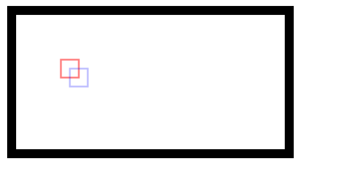
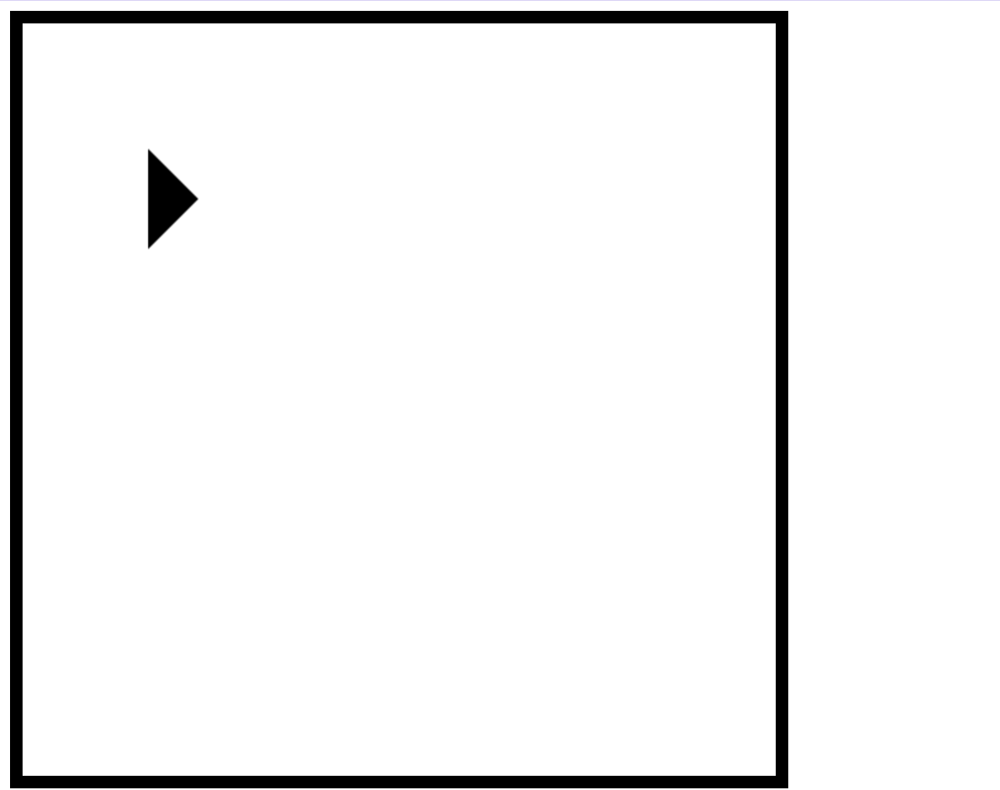
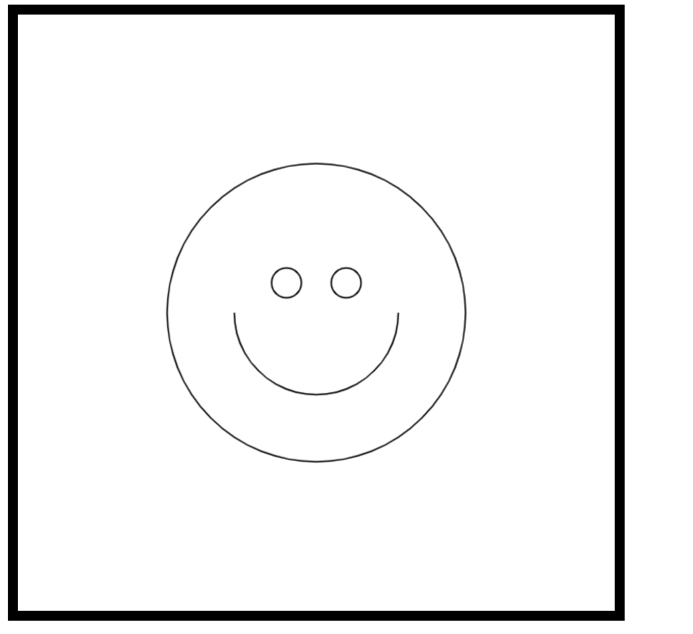
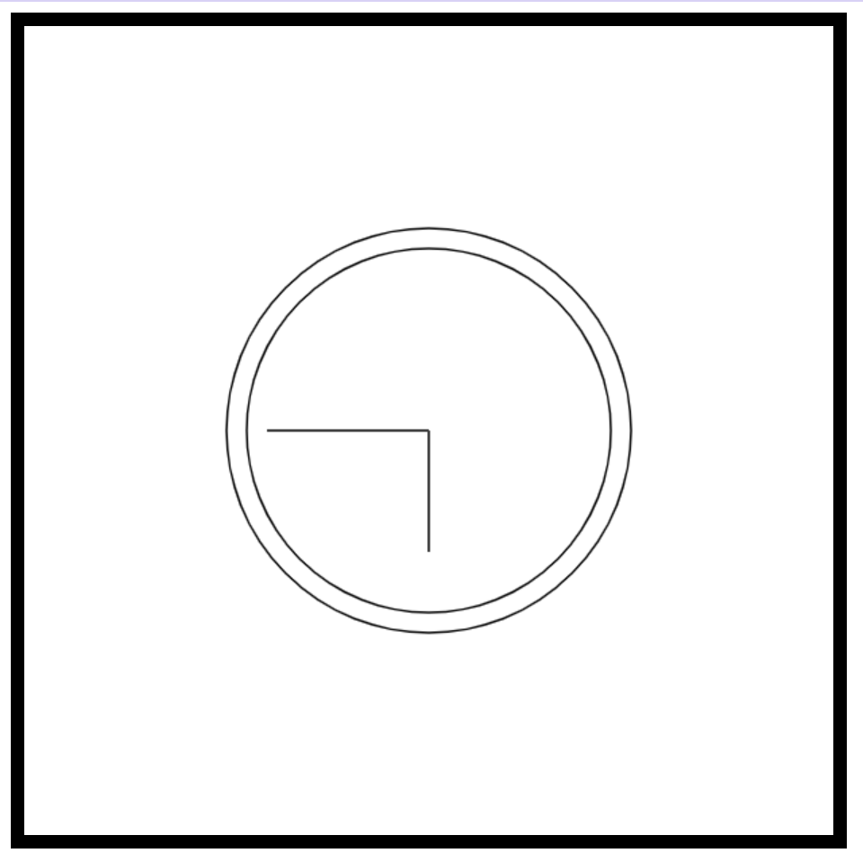
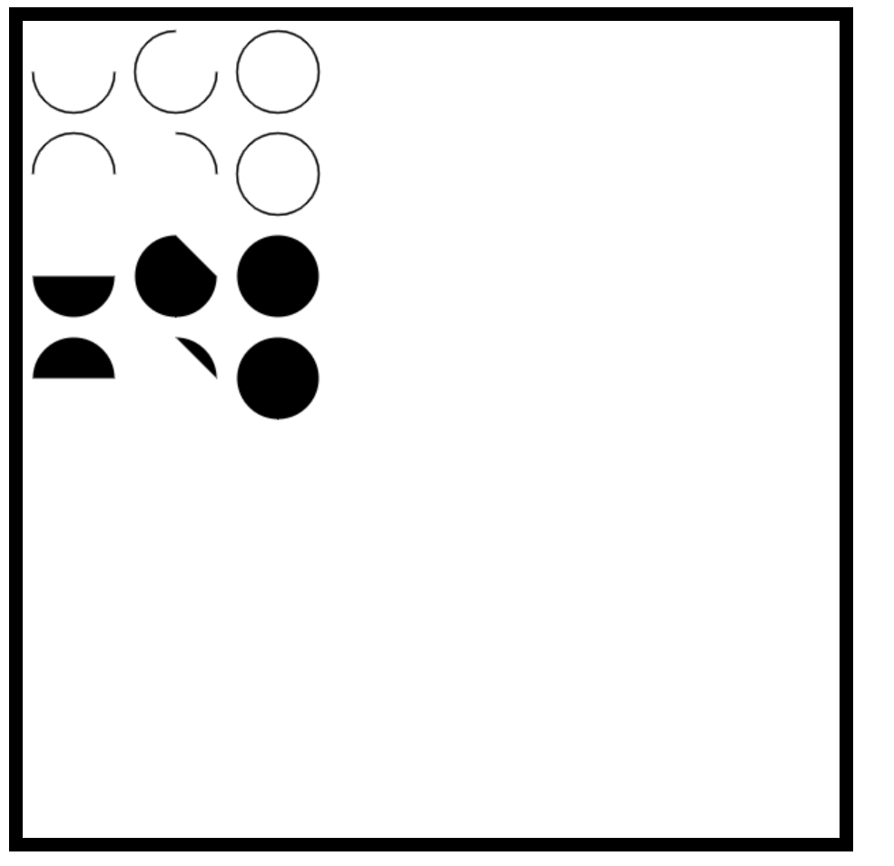
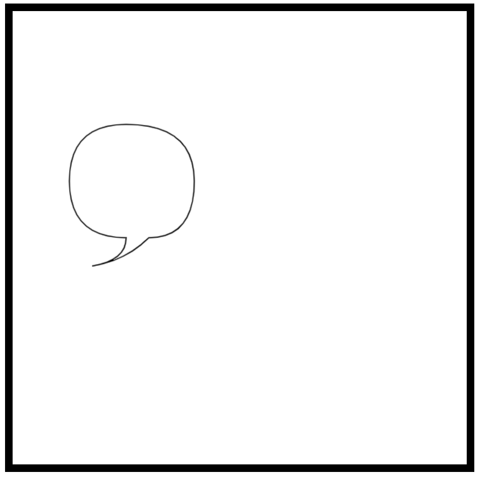

# 1. canvas标签 注意事项
 + 支持[全局属性](https://developer.mozilla.org/zh-CN/docs/Web/HTML/Global_attributes)
 + canvas标签必须要有对标签
 + height 默认为300 不需要单位以(px)展示
 + width 默认为150
 + canvas标签需要闭合标签\</canvas\>

```html
<canvas id="canvas" width="300" height="300">
  抱歉，您的浏览器不支持 canvas 元素
 （这些内容将会在不支持<canvas>元素的浏览器或是禁用了 JavaScript 的浏览器内渲染并展现）
</canvas>
```

# 2. Canvas API
## 2.1 2d绘图上下文
+ 获取的canvas标签的对象身上有 `getContext`方法,传入的参数是一个指示使用何种上下文的 `DOMString`
  + "2d", 建立一个 CanvasRenderingContext2D 二维渲染上下文。
  + "webgl" (或"experimental-webgl") 这将创建一个WebGLRenderingContext 三维渲染上下文对象。只在实现WebGL 版本 1(OpenGL ES 2.0) 的浏览器上可用。
  + "webgl2" (或 "experimental-webgl2") 这将创建一个 WebGL2RenderingContext 三维渲染上下文对象。只在实现 WebGL 版本 2 (OpenGL ES 3.0) 的浏览器上可用。
  + "bitmaprenderer" 这将创建一个只提供将 canvas 内容替换为指定ImageBitmap功能的ImageBitmapRenderingContext 。
    ```js
    const canvasTag = document.querySelector(".canvas");
    // 1. 获取 2d context
    if (canvasTag.getContext) {
    const ctx = canvasTag.getContext("2d");
    console.log(ctx, "the rendering context");
    ctx.fillStyle = "rgb(200,0,0)";
    ctx.fillRect(10, 10, 55, 50);

    ctx.fillStyle = "rgba(0, 0, 200, 0.5)";
    ctx.fillRect(30, 30, 55, 50);
    } 
    ```

## 2.2 填充(fillStyle)和描边(strokeStyle)
+ 填充以指定样式（颜色、渐变或图像）自动填充形状，而描边只为图形边界着色。大多数 2D 上下文操作有填充和描边的变体，显示效果取决于两个属性：fillStyle 和 strokeStyle。
+ 这两个属性可以是**字符串、渐变对象或图案对象**，默认值都为"#000000"。字符串表示颜色值，可以是 CSS 支持的任意格式：名称、十六进制代码、rgb、rgba、hsl 或 hsla。
  ```js
  ctx.strokeStyle = "#bfa";
  ctx.fillStyle = "#bfa";
  ctx.fillRect(50, 50, 20, 20);
  ```

## 2.3 绘制图形
+ 矩形是唯一一个可以直接在 2D 绘图上下文中绘制的形状。与绘制矩形相关的方法有 3 个：
fillRect()、strokeRect()和 clearRect()
这些方法都接收 4 个参数：矩形 x 坐标、矩形 y 坐标、矩形宽度和矩形高度。这几个参数的单位都是像素。
+ 绘制图形时需要先上色再绘制, 否则可能上色失败
  - [x] 先上色,在绘制 ` ctx.fillStyle = "#bfa";ctx.fillRect(40, 40, 20, 20);`
  - [ ] 先绘制,再上色 `ctx.fillRect(80, 40, 20, 20);
ctx.fillStyle = "#bfa";`


### 2.3.1 fillRect 和 fillStyle
+  绘制并填充矩形(实心的矩形), 矩形颜色由`fillStyle`来控制
+  ```js
    ctx.fillStyle = "#bfa";
    ctx.fillRect(40, 40, 20, 20);
   ```

### 2.3.2 strokeRect 和 strokeStyle
+ strokeRect()方法使用通过 strokeStyle 属性指定的颜色绘制矩形轮廓
+ ```js
    ctx.strokeStyle = "red";
    ctx.strokeRect(50, 50, 20, 20);

    ctx.strokeStyle = "rgba(0,0,255,0.5)";
    ctx.strokeRect(60, 60, 20, 20);
  ```
  

+ 注意:
  + 注意 描边宽度由 lineWidth 属性控制，它可以是任意整数值。类似地lineCap 属性控制线条端点的形状［"butt"（平头）、"round"（出圆头）或"square"（出方头）］，而 lineJoin属性控制线条交点的形状［"round"（圆转）、"bevel"（取平）或"miter"（出尖）］。

### 2.3.3 clearRect
+ 使用 clearRect()方法可以擦除画布中某个区域(透明色的实心方形)。该方法用于把绘图上下文中的某个区域变透明。
通过先绘制形状再擦除指定区域，可以创建出有趣的效果，比如从已有矩形中开个孔。
+ ```js
  ctx.fillStyle = "#bfa";
  ctx.fillRect(40, 40, 80, 80);
  ctx.fillStyle = "rgba(0,0,255,0.5)";
  ctx.fillRect(60, 60, 80, 80);
  ctx.clearRect(60, 60, 40, 40);
  ```

## 2.4 绘制路径
+ 图形的基本元素是路径。路径是通过不同颜色和宽度的线段或曲线相连形成的不同形状的点的集合。一个路径，甚至一个子路径，都是闭合的。使用路径绘制图形需要一些额外的步骤。
  + 首先，你需要创建路径起始点。
    然后你使用画图命令去画出路径。
    之后你把路径封闭。
    一旦路径生成，你就能通过描边或填充路径区域来渲染图形。
  + 以下是所用到的函数
  + **beginPath()**
  新建一条路径，生成之后，图形绘制命令被指向到路径上生成路径。

  + **closePath()**
  闭合路径之后图形绘制命令又重新指向到上下文中。

  + **stroke()**
  通过线条来绘制图形轮廓。

  + **fill()**
  通过填充路径的内容区域生成实心的图形。 
+ 可以调用下列方法来绘制路径
  + **arc(x, y, radius, startAngle, endAngle, counterclockwise)**：以坐标(x, y)为圆心，以 radius 为半径绘制一条弧线，起始角度为 startAngle，结束角度为 endAngle（都是弧度）。最后一个参数 counterclockwise 表示是否逆时针计算起始角度和结束角度（默认为顺时针）。
  + **arcTo(x1, y1, x2, y2, radius)**：以给定半径 radius，经由(x1, y1)绘制一条从上一点到(x2, y2)的弧线。
  + **bezierCurveTo(c1x, c1y, c2x, c2y, x, y)**：以(c1x, c1y)和(c2x, c2y)为控制点，绘制一条从上一点到(x, y)的弧线（三次贝塞尔曲线）。
  + **lineTo(x, y)**：绘制一条从上一点到(x, y)的直线。
  + **moveTo(x, y)**：不绘制线条，只把绘制光标移动到(x, y)。
  + **quadraticCurveTo(cx, cy, x, y)**：以(cx, cy)为控制点，绘制一条从上一点到(x, y)
的弧线（二次贝塞尔曲线）。
  + **rect(x, y, width, height)**：以给定宽度和高度在坐标点(x, y)绘制一个矩形。这个方法与 strokeRect()和 fillRect()的区别在于，它创建的是一条路径，而不是独立的图形

+ 创建路径之后，可以使用 closePath()方法绘制一条返回起点的线。如果路径已经完成，则既可以指定 fillStyle 属性并调用 fill()方法来填充路径，也可以指定 strokeStyle 属性并调用stroke()方法来描画路径，还可以调用 clip()方法基于已有路径创建一个新剪切区域。
+ 生成路径的第一步叫做 beginPath()。本质上，路径是由很多子路径构成，这些子路径都是在一个列表中，所有的子路径（线、弧形、等等）构成图形。而每次这个方法调用之后，列表清空重置，然后我们就可以重新绘制新的图形。
  + `备注： 当前路径为空，即调用 beginPath() 之后，或者 canvas 刚建的时候，第一条路径构造命令通常被视为是 moveTo（），无论实际上是什么。出于这个原因，你几乎总是要在设置路径之后专门指定你的起始位置。`

+ 第二步就是调用函数指定绘制路径，本文稍后我们就能看到了。

+ 第三，就是闭合路径 closePath(),不是必需的。这个方法会通过绘制一条从当前点到开始点的直线来闭合图形。如果图形是已经闭合了的，即当前点为开始点，该函数什么也不做。
  + `备注： 当你调用 fill() 函数时，所有没有闭合的形状都会自动闭合，所以你不需要调用 closePath() 函数。但是调用 stroke() 时不会自动闭合。`


### 2.4.1 绘制一个三角形 moveTo,lineTo的用法
```js
function drawTriangle() {
  ctx.beginPath();
  ctx.moveTo(100, 100);
  ctx.lineTo(140, 140);
  ctx.lineTo(100, 180);
  ctx.fill();
}
```


### 2.4.2 绘制一个笑脸 moveTo,arc,stroke的用法
```js
// 2. 绘制一个笑脸
function drawSmile() {
  ctx.beginPath();
  // moveTo 笔开始画的位置
  ctx.arc(200, 200, 100, 0, Math.PI * 2, true); // 半圆
  ctx.moveTo(255, 200); // 移动到绘制的起点的正下方
  ctx.arc(200, 200, 55, 0, Math.PI, false); // 顺时针
  ctx.moveTo(190, 180);
  ctx.arc(180, 180, 10, 0, Math.PI * 2, true); // 左眼
  ctx.moveTo(230, 180);
  ctx.arc(220, 180, 10, 0, Math.PI * 2, true); // 右眼
  ctx.stroke();
}
```


### 2.4.3 绘制一个 不带数字的表盘 isPointInPath(x,y)
+ 接收 x 轴和 y 轴坐标作为参数。这个方法用于确定指定的点是否在路径
上，可以在关闭路径前随时调用
  ```js
  function drawDial() {
    ctx.beginPath(); // 开始绘制
    ctx.arc(200, 200, 100, 0, Math.PI * 2, true); // 绘制外圆
    ctx.moveTo(290, 200); // 内圆
    ctx.arc(200, 200, 90, 0, Math.PI * 2, true); // 内圆
    ctx.moveTo(200, 200);
    ctx.lineTo(200, 260); // 分针
    ctx.moveTo(200, 200);
    ctx.lineTo(120, 200); // 时针
    console.log(ctx.isPointInPath(200, 200)); //true isPointInPath 接收 x 轴和 y 轴坐标作为参数。
    // 这个方法用于确定指定的点是否在路径上，可以在关闭路径前随时调用
    ctx.stroke();
  }
  ```
  

### 2.4.4 圆弧 arcTo();fill();
+ 弧度的计算(rad) 
+ 弧度的计算公式为 l/r l为弧长,r为半径
+ 圆周的周长是2Πr，那么圆周的弧度=2Πr/r=2Π。则180°角的弧度是Π。
  `备注： arc() 函数中表示角的单位是弧度，不是角度。角度与弧度的 js 表达式：弧度=(Math.PI/180)*角度。`

  ```js
  function drawCircle() {
    for (let i = 0; i < 4; i++) {
      for (let j = 0; j < 3; j++) {
        ctx.beginPath();
        const x = 25 + j * 50; // x坐标 三行
        const y = 25 + i * 50; // y坐标
        const radius = 20; // 圆弧半径
        const startAngel = 0; // 开始点
        const endAngle = Math.PI + (Math.PI * j) / 2; // 结束点
        const anticeclockwise = i % 2 === 0 ? false : true; // 顺时针 或者逆时针
        ctx.arc(x, y, radius, startAngel, endAngle, anticeclockwise);
        if (i > 1) {
          ctx.fill(); // 结束绘制
        } else {
          ctx.stroke(); // 结束绘制
        }
      }
    }
  }
  ```
  


### 2.4.5 二次贝塞尔曲线以及三次贝塞尔曲线
+ `quadraticCurveTo(cp1x, cp1y, x, y)`
  + 绘制二次贝塞尔曲线，cp1x,cp1y 为一个控制点，x,y 为结束点。

+ `bezierCurveTo(cp1x, cp1y, cp2x, cp2y, x, y)`
  + 绘制三次贝塞尔曲线，cp1x,cp1y为控制点一，cp2x,cp2y为控制点二，x,y为结束点。
  
+ 右边的图能够很好的描述两者的关系，二次贝塞尔曲线有一个开始点（蓝色）、一个结束点（蓝色）以及一个控制点（红色），而三次贝塞尔曲线有两个控制点。

+ 参数 x、y 在这两个方法中都是结束点坐标。cp1x,cp1y为坐标中的第一个控制点cp2x,cp2y为坐标中的第二个控制点。

#### 1. 二次贝塞尔曲线
+ 使用多个贝塞尔曲线来渲染对话气泡。
  ```js
  ctx.beginPath(); // 开始绘制
  ctx.moveTo(100, 100); // 开始点
  ctx.quadraticCurveTo(50, 100, 50, 150); // 控制点 x,y; 结束点 x,y
  // console.log(ctx.isPointInPath(100, 100));
  ctx.quadraticCurveTo(50, 200, 100, 200);
  ctx.quadraticCurveTo(100, 220, 70, 225);
  ctx.quadraticCurveTo(100, 220, 120, 200);
  ctx.quadraticCurveTo(160, 200, 160, 150);
  ctx.quadraticCurveTo(160, 100, 100, 100);

  ctx.stroke(); // 绘制线条
  ```
  

#### 2. 三次贝塞尔曲线 待研究

### 2.4.6 矩形 rect()方法
+ rect(x, y, width, height)
  + 绘制一个左上角坐标为（x,y），宽高为 width 以及 height 的矩形。

+ **当该方法执行的时候，moveTo() 方法自动设置坐标参数（0,0）。也就是说，当前笔触自动重置回默认坐标。**


### 2.4.7 组合使用 待研究


## 2.5 Path2D对象
+ 为了简化代码和提高性能，Path2D对象已可以在较新版本的浏览器中使用，用来缓存或记录绘画命令
+ 生成一个Path2D 对象
  ```js
  new Path2D();// 空的path对象
  new Path2D(path);// 克隆Path对象
  new Path2D(d); // 从SVG建立Path对象

+ addPath( 方法)
  + Path2D.addPath(path [, transform])​
  + 添加了一条路径到当前路径（可能添加了一个变换矩阵）。

+ 示例 ,加深对 stroke(),fill() 函数的理解
  ```js
  function usePath2D() {
    const rectangle = new Path2D();
    rectangle.rect(100, 100, 100, 100);

    const circle = new Path2D();
    circle.moveTo(250, 250);
    circle.arc(250, 250, 30, 0, Math.PI * 2, false);

    ctx.stroke(rectangle);
    ctx.fill(circle);
  }
  usePath2D();
  ```


+ 使用SVG PATHS
  + 新的 Path2D API 有另一个强大的特点，就是使用 SVG path data 来初始化 canvas 上的路径。这将使你获取路径时可以以 SVG 或 canvas 的方式来重用它们。

  + 这条路径将先移动到点 (M10 10) 然后再水平移动 80 个单位(h 80)，然后下移 80 个单位 (v 80)，接着左移 80 个单位 (h -80)，再回到起点处 (z)。
  ```js
    const p = new Path2D("M10 10 h 80 v 80 h -80 Z");
    ctx.fill(p);
  ```