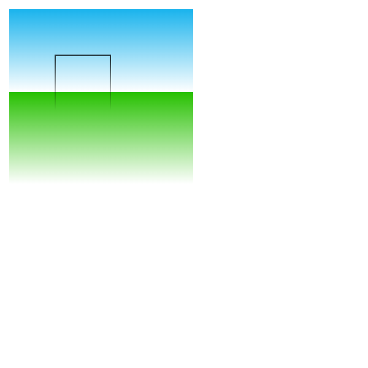

# 1. Colors
+ 如果我们想要给图形上色，有两个重要的属性可以做到：
  + `fillStyle = color`
  设置图形的填充颜色。

  + `strokeStyle = color`
  设置图形轮廓的颜色。
  + color 可以是表示 CSS 颜色值的字符串，渐变对象或者图案对象。默认情况下，线条和填充颜色都是黑色（CSS 颜色值 #000000）。
  
+ 先上色,再绘制. 一旦您设置了 strokeStyle 或者 fillStyle 的值，那么这个新值就会成为新绘制的图形的默认值。如果你要给每个图形上不同的颜色，你需要重新设置 fillStyle 或 strokeStyle 的值。

## 1.1 fillStyle 示例 设置图形的填充颜色。
+ 用两个变量 i 和 j 来为每一个方格产生唯一的 RGB 色彩值，其中仅修改红色和绿色通道的值，而保持蓝色通道的值不变
  ```js
  function useFillStyle() {
    for (let i = 0; i < 255; i++) {
      for (let j = 0; j < 255; j++) {
        ctx.fillStyle = `rgb(${Math.floor(255 - 1 * i)},${Math.floor(
          255 - 1 * j
        )},0)`;
        ctx.fillRect(j * 1, i * 1, 1, 1);
      }
    }
  }

  useFillStyle();
  ```
  

## 1.2 strokeStyle 使用 设置图形轮廓的颜色。
  ```js
  function useStrokeStyle() {
    for (let i = 0; i < 6; i++) {
      for (let j = 0; j < 6; j++) {
        ctx.strokeStyle = `rgb(0,${Math.floor(255 - 42.5 * i)},${Math.floor(
          255 - 42.5 * j
        )})`;
        ctx.beginPath();
        ctx.arc(12.5 + j * 25, 12.5 + i * 25, 10, 0, Math.PI * 2, true);
        ctx.stroke();
      }
    }
  }

  useStrokeStyle();
  ```
  


# 2. Transparency 透明度
+ 通过设置 globalAlpha 属性或者使用一个半透明颜色作为轮廓或填充的样式。
+ `globalAlpha = transparencyValue`
+ 这个属性影响到 canvas 里**所有图形**的透明度，有效的值范围是 0.0（完全透明）到 1.0（完全不透明），默认是 1.0。

+ globalAlpha 示例
  + 将用四色格作为背景，设置 globalAlpha 为 0.2 后，在上面画一系列半径递增的半透明圆。最终结果是一个径向渐变效果。圆叠加得越更多，原先所画的圆的透明度会越低。通过增加循环次数，画更多的圆，从中心到边缘部分，背景图会呈现逐渐消失的效果。
   ```js
  function useGlobalAlpha() {
    // 背景
    ctx.fillStyle = "#FD0";
    ctx.fillRect(0, 0, 75, 75);
    ctx.fillStyle = "#6C0";
    ctx.fillRect(75, 0, 75, 75);
    ctx.fillStyle = "#09F";
    ctx.fillRect(0, 75, 75, 75);
    ctx.fillStyle = "#F30";
    ctx.fillRect(75, 75, 75, 75);
    ctx.fillStyle = "#FFF";

    ctx.globalAlpha = 0.2;
    for (let i = 0; i < 7; i++) {
      ctx.beginPath();
      ctx.arc(75, 75, 10 + 10 * i, 0, Math.PI * 2);
      ctx.fill();
    }
  }

  useGlobalAlpha();
  ```
  

+ 也可以使用rgba
  ```js
  // 画背景
  ctx.fillStyle = 'rgb(255,221,0)';
  ctx.fillRect(0,0,150,37.5);
  ctx.fillStyle = 'rgb(102,204,0)';
  ctx.fillRect(0,37.5,150,37.5);
  ctx.fillStyle = 'rgb(0,153,255)';
  ctx.fillRect(0,75,150,37.5);
  ctx.fillStyle = 'rgb(255,51,0)';
  ctx.fillRect(0,112.5,150,37.5);

  // 画半透明矩形
  for (var i=0;i<10;i++){
    ctx.fillStyle = 'rgba(255,255,255,'+(i+1)/10+')';
    for (var j=0;j<4;j++){
      ctx.fillRect(5+i*14,5+j*37.5,14,27.5)
    }
  }
  ```
  

# 3. Line Style 线型
  + 可以通过一系列属性来设置线的样式。
    + `lineWidth = value`
      + 设置线条宽度。
    + `lineCap = type` 
      + 设置线条末端样式。
    + `lineJoin = type`
      + 设定线条与线条间接合处的样式。
    + `miterLimit = value`
      + 限制当两条线相交时交接处最大长度；所谓交接处长度（斜接长度）是指线条交接处内角顶点到外角顶点的长度。
    + `getLineDash()`
      + 返回一个包含当前虚线样式，长度为非负偶数的数组。
    + `setLineDash(segments)`
      + 设置当前虚线样式。
    + `lineDashOffset = value`
      + 设置虚线样式的起始偏移量。

## 3.1 lineWidth
+ 这个属性设置当前绘线的粗细。属性值必须为正数。默认值是 1.0。
+ 线宽是指给定路径的中心到两边的粗细。换句话说就是在路径的两边各绘制线宽的一半。因为画布的坐标并不和像素直接对应，当需要获得精确的水平或垂直线的时候要特别注意。  
  ```js
  for (let i = 0; i < 10; i++) {
    ctx.lineWidth = 1 + i;
    ctx.beginPath();
    ctx.moveTo(10 + i * 14, 5);
    ctx.lineTo(10 + i * 14, 200);
    ctx.stroke();
  }
  ```
  
+ 用递增的宽度绘制了 10 条直线。最左边的线宽 1.0 单位。并且，最左边的以及所有宽度为奇数的线并不能精确呈现，这就是因为路径的定位问题。
+ [想要获得精确的线条，必须对线条是如何描绘出来的有所理解](https://developer.mozilla.org/zh-CN/docs/Web/API/Canvas_API/Tutorial/Applying_styles_and_colors#%E7%BA%BF%E5%9E%8B_line_styles)。
   
+ 如果你想要绘制一条从 (3,1) 到 (3,5)，宽度是 1.0 的线条，你会得到像第二幅图一样的结果。实际填充区域（深蓝色部分）仅仅延伸至路径两旁各一半像素。而这半个像素又会以近似的方式进行渲染，这意味着那些像素只是部分着色，结果就是以实际笔触颜色一半色调的颜色来填充整个区域（浅蓝和深蓝的部分）。这就是上例中为何宽度为 1.0 的线并不准确的原因。

+ 要解决这个问题，你必须对路径施以更加精确的控制。已知粗 1.0 的线条会在路径两边各延伸半像素，那么像第三幅图那样绘制从 (3.5,1) 到 (3.5,5) 的线条，其边缘正好落在像素边界，填充出来就是准确的宽为 1.0 的线条。
+ <a style="background-color:'#0085f2'">
  备注： 在这个竖线的例子中，其 Y 坐标刚好落在网格线上，否则端点上同样会出现半渲染的像素点（但还要注意，这种行为的表现取决于当前的 lineCap 风格，它默认为 butt；您可能希望通过将 lineCap 样式设置为 square 正方形，来得到与奇数宽度线的半像素坐标相一致的笔画，这样，端点轮廓的外边框将被自动扩展以完全覆盖整个像素格）。
  还请注意，只有路径的起点和终点受此影响：如果一个路径是通过 closePath() 来封闭的，它是没有起点和终点的；相反的情况下，路径上的所有端点都与上一个点相连，下一段路径使用当前的 lineJoin 设置（默认为 miter），如果相连路径是水平和/或垂直的话，会导致相连路径的外轮廓根据相交点自动延伸，因此渲染出的路径轮廓会覆盖整个像素格。接下来的两个小节将展示这些额外的行样式。</a>
+ 对于那些宽度为偶数的线条，每一边的像素数都是整数，那么你想要其路径是落在像素点之间 (如那从 (3,1) 到 (3,5)) 而不是在像素点的中间。同样，注意到那个例子的垂直线条，其 Y 坐标刚好落在网格线上，如果不是的话，端点上同样会出现半渲染的像素点。

+ 虽然开始处理可缩放的 2D 图形时会有点小痛苦，但是及早注意到像素网格与路径位置之间的关系，可以确保图形在经过缩放或者其它任何变形后都可以保持看上去蛮好：线宽为 1.0 的垂线在放大 2 倍后，会变成清晰的线宽为 2.0，并且出现在它应该出现的位置上。

## 3.2 LineCap 属性
+ 属性 lineCap 的值决定了线段端点显示的样子。它可以为下面的三种的其中之一：butt，round 和 square。默认是 butt。
  ```js
  const lineCapList = ["butt", "round", "square"];
  // 1. 创建辅助线
  ctx.strokeStyle = "#09f";
  ctx.beginPath();
  ctx.moveTo(100, 100);
  ctx.lineTo(200, 100);
  ctx.moveTo(100, 200);
  ctx.lineTo(200, 200);
  ctx.stroke();

  // 2.创建不同lineCap的线段
  for (let i = 0; i < lineCapList.length; i++) {
    ctx.lineWidth = 10;
    ctx.lineCap = lineCapList[i];
    ctx.beginPath();
    ctx.moveTo(120 + i * 20, 100);
    ctx.lineTo(120 + i * 20, 200);
    ctx.stroke();
  }
  ```
  

## 3.3 lineJoin 
+ lineJoin 的属性值决定了图形中两线段连接处所显示的样子。它可以是这三种之一：round, bevel 和 miter。默认是 miter。
  ```js
  const lineJoinList = ["round", "bevel", "miter"];
  // 1. 创建辅助线
  ctx.lineWidth = 10;
  ctx.lineCap = "butt";
  // 2.创建不同lineCap的线段
  for (let i = 0; i < lineJoinList.length; i++) {
    ctx.lineJoin = lineJoinList[i];
    ctx.beginPath();
    ctx.moveTo(100, 100 + i * 40);
    ctx.lineTo(140, 140 + i * 40);
    ctx.lineTo(180, 100 + i * 40);
    ctx.lineTo(220, 140 + i * 40);
    ctx.lineTo(260, 100 + i * 40);
    ctx.stroke();
  }
  ```
  
## 3.4 [miterLimit 属性的演示例子](https://developer.mozilla.org/zh-CN/docs/Web/API/Canvas_API/Tutorial/Applying_styles_and_colors#%E7%BA%BF%E5%9E%8B_line_styles)
+ miterLimit 属性就是用来设定外延交点与连接点的最大距离，如果交点距离大于此值，连接效果会变成了 bevel。注意，最大斜接长度（即交点距离）是当前坐标系测量线宽与此miterLimit属性值（HTML \<canvas>默认为 10.0）的乘积，所以miterLimit可以单独设置，不受显示比例改变或任何仿射变换的影响：它只影响线条边缘的有效绘制形状。
+ 更准确的说，斜接限定值（miterLimit）是延伸长度（在 HTML Canvas 中，这个值是线段外连接点与路径中指定的点之间的距离）与一半线宽的最大允许比值。
  
## 3.5 使用虚线
+ 用 `setLineDash`方法和 `lineDashOffset` 属性来制定虚线样式。`setLineDash` 方法接受一个数组，来指定线段与间隙的交替；`lineDashOffset` 属性设置起始偏移量。
+ 创建一个蚂蚁线的效果。它往往应用在计算机图形程序选区工具动效中。它可以帮助用户通过动画的边界来区分图像背景选区边框。
  ```js
  let offset = 0;
  function drawDashLine() {
    ctx.clearRect(0, 0, 400, 400);
    ctx.setLineDash([4, 2]);
    ctx.lineDashOffset = -offset;
    ctx.strokeRect(10, 10, 100, 100);
  }

  function march() {
    offset++;
    if (offset > 16) {
      offset = 0;
    }
    drawDashLine();
    // setTimeout(march, 20);
    requestAnimationFrame(march);
  }
  march();
  ```
  

# 4. 渐变 Gradients

+ `createLinearGradient(x1,y1,x2,y2)` 线性渐变
  + createLinearGradient 方法接受 4 个参数，表示渐变的起点 (x1,y1) 与终点 (x2,y2)。

+ `createRadialGradient(x1,y1,r1,x2,y2,r2)` 径向渐变
  + createRadialGradient 方法接受 6 个参数，前三个定义一个以 (x1,y1) 为原点，半径为 r1 的圆，后三个参数则定义另一个以 (x2,y2) 为原点，半径为 r2 的圆。
+ `addColorStop(position,color)`
  + addColorStop 方法接受 2 个参数，position 参数必须是一个 0.0 与 1.0 之间的数值，表示渐变中颜色所在的相对位置。例如，0.5 表示颜色会出现在正中间。color 参数必须是一个有效的 CSS 颜色值（如 #FFF，rgba(0,0,0,1)，等等）。
  + 可以根据需要添加任意多个色标（color stops）。下面是最简单的线性黑白渐变的例子。
  ```js
  const lineargradient = ctx.createLinearGradient(0,0,150,150);
  lineargradient.addColorStop(0,'white');
  lineargradient.addColorStop(1,'black');
  ```
+ **第一步  创建 gradient 对象**
  ```js
    const lineargradient = ctx.createLinearGradient(0,0,150,150);
    const radialgradient = ctx.createRadialGradient(75,75,0,75,75,100);
  ```
+ **第二步 使用addColorStop方法上色**
  ```js
    lineargradient.addColorStop(0,'white');
    lineargradient.addColorStop(1,'black');
  ```

## 4.1 createLinearGradient 线性渐变对象
+ `strokeStyle`和`fillStyle`属性都可以接受`canvasGradient`对象。(其实类似于css中的background属性)
  ```js
    // 1. 创建第一个 gradient对象
    const linearGradient01 = ctx.createLinearGradient(0, 0, 0, 200);
    linearGradient01.addColorStop(0, "#00ABEB");
    linearGradient01.addColorStop(0.5, "#fff");
    linearGradient01.addColorStop(0.5, "#26C000");
    linearGradient01.addColorStop(1, "#FFF");

    // 2. 创建第二个 gradient 对象
    const linearGradient02 = ctx.createLinearGradient(0, 10, 0, 120);
    linearGradient02.addColorStop(0.5, "#000");
    linearGradient02.addColorStop(1, "rgba(0,0,0,0)");
    ctx.strokeStyle = linearGradient02; // 接收渐变对象
    ctx.fillStyle = linearGradient01; // 接收渐变对象

    ctx.fillRect(10, 10, 200, 200);
    ctx.strokeRect(60, 60, 60, 60);
  ```
  

## 4.2 createGridalGradient 径向渐变对象
```js
const radGrad01 = ctx.createRadialGradient(45, 45, 10, 52, 50, 30);
  radGrad01.addColorStop(0, "#A7D30C");
  radGrad01.addColorStop(0.9, "#019F62");
  radGrad01.addColorStop(1, "rgba(1,159,98,0.5)");

  const radGrad02 = ctx.createRadialGradient(105, 105, 20, 112, 120, 50);
  radGrad02.addColorStop(0, "#FF0188");
  radGrad02.addColorStop(0.65, "#FF5F98");
  radGrad02.addColorStop(1, "rgba(255,1,136,0)");

  const radGrad03 = ctx.createRadialGradient(95, 15, 15, 102, 20, 40);
  radGrad03.addColorStop(0, "#00C9FF");
  radGrad03.addColorStop(0.5, "#00B5E2");
  radGrad03.addColorStop(1, "rgba(0,201,255,0.7)");

  const radGrad04 = ctx.createRadialGradient(0, 150, 50, 0, 140, 90);
  radGrad04.addColorStop(0, "#F4F201");
  radGrad04.addColorStop(0.8, "#E4C700");
  radGrad04.addColorStop(1, "rgba(228,199,0,0)");

  ctx.fillStyle = radGrad01;
  ctx.fillRect(0, 0, 150, 150);
  ctx.fillStyle = radGrad02;
  ctx.fillRect(0, 0, 150, 150);
  ctx.fillStyle = radGrad03;
  ctx.fillRect(0, 0, 150, 150);
  ctx.fillStyle = radGrad04;
  ctx.fillRect(0, 0, 150, 150);
```


## 2.6 图片样式 patterns
+ createPattern(image, type)
  + 该方法接受两个参数。Image 可以是一个 **Image 对象的引用**，或者另一个 **canvas 对象**。Type 必须是下面的字符串值之一：repeat，repeat-x，repeat-y 和 no-repeat。
+ 图案的应用跟渐变很类似的，创建出一个 pattern 之后，赋给 fillStyle 或 strokeStyle  属性即可。
  ```js
    const img = new Image();
    img.src = 'someimage.png';
    const ptrn = ctx.createPattern(img,'repeat');
  ```
+ createPattern
+ new Image = document.createElement('img')
  ```js
    // 创建Image对象
  const img = new Image(); // 等价于 const img=document.createElement("img")
  img.src =
    "https://developer.mozilla.org/en-US/docs/Web/API/Canvas_API/Tutorial/Applying_styles_and_colors/canvas_createpattern.png";
  img.onload = () => {
    const pattern = ctx.createPattern(img, "repeat");
    ctx.fillStyle = pattern;
    ctx.fillRect(0, 0, 400, 400);
  };
  ```
  

## 2.7 shadow 阴影
+ `shadowOffsetX = float`
  + `shadowOffsetX` 和 `shadowOffsetY` 用来设定阴影在 X 和 Y 轴的延伸距离，它们是不受变换矩阵所影响的。负值表示阴影会往上或左延伸，正值则表示会往下或右延伸，它们默认都为 0。

+ `shadowOffsetY = float`
  + `shadowOffsetX` 和 `shadowOffsetY` 用来设定阴影在 X 和 Y 轴的延伸距离，它们是不受变换矩阵所影响的。负值表示阴影会往上或左延伸，正值则表示会往下或右延伸，它们默认都为 0。

+ `shadowBlur = float`
  + `shadowBlur` 用于设定阴影的模糊程度，其数值并不跟像素数量挂钩，也不受变换矩阵的影响，默认为 0。

+ `shadowColor = color`
  + `shadowColor` 是标准的 CSS 颜色值，用于设定阴影颜色效果，默认是全透明的黑色。

+ 文字阴影的例子
  ```js
    ctx.shadowOffsetX = 10;
  ctx.shadowOffsetY = 10;
  ctx.shadowBlur = 1;
  ctx.shadowColor = "rgba(0,0,255,0.5)";
  ctx.font = "20px Times New Roman"; // 创建字体
  ctx.fillStyle = "Black";
  ctx.fillText("Live Sample", 100, 200); // 填充字体内容
  ```
  

## 2.8 canvas 填充规则
+ 当用到 fill（或者 clip和isPointinPath ）可以选择一个填充规则，该填充规则根据某处在路径的外面或者里面来决定该处是否被填充，这对于自己与自己路径相交或者路径被嵌套的时候是有用的。
+ 两个可能的值：
  + nonzero
  non-zero winding rule, 默认值。
  + evenodd
  even-odd winding rule.

  ```js
    ctx.beginPath();
    ctx.arc(50, 50, 30, 0, Math.PI * 2, true);
    ctx.arc(50, 50, 10, 0, Math.PI * 2, true);
    ctx.fill("evenodd");
  ```
  
  