# 1. 绘制文本
+ canvas 提供了两种方法来绘制文本
  + `fillText(text, x, y [, maxWidth])`
    + 在指定的 (x,y) 位置填充指定的文本，绘制的最大宽度是可选的。
  + `strokeText(text, x, y [, maxWidth])`
    + 在指定的 (x,y) 位置绘制文本边框，绘制的最大宽度是可选的。

## 1.1 fillText()
```js
  ctx.font = "48px serif";
  ctx.fillText("Hello world", 100, 100);
```


## 1.2 strokeText()
```js
  ctx.font = "48px serif";
  ctx.strokeText("Hello world", 100, 100);
```


## 1.3 有样式的文本
+ font = value
当前我们用来绘制文本的样式。这个字符串使用和 CSS font 属性相同的语法。默认的字体是 10px sans-serif。

+ textAlign = value
文本对齐选项。可选的值包括：start, end, left, right or center. 默认值是 start。

+ textBaseline = value
基线对齐选项。可选的值包括：top, hanging, middle, alphabetic, ideographic, bottom。默认值是 alphabetic。

+ direction = value
  文本方向。可能的值包括：ltr, rtl, inherit。默认值是 inherit。

  ```js
    ctx.font = "20px serif";
    ctx.textAlign = "left";
    ctx.direction = "ltr";
    ctx.textBaseline = "alphabetic";
    ctx.strokeText("Hello world 哈哈", 100, 100);
  ```

## 1.4 预测量文本宽度
+ `measureText()`
  + 将返回一个 TextMetrics对象的宽度、所在像素，这些体现文本特性的属性。
  ```js
  console.log(ctx.measureText("hellow world哈哈"));
  ```
  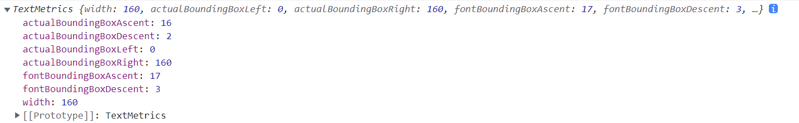


# 2. 使用图像

+ 引入图像到 canvas 里需要以下两步基本操作：
  1. 获得一个指向HTMLImageElement的对象或者另一个 canvas 元素的引用作为源，也可以通过提供一个 URL 的方式来使用图片（参见例子）
  2. 使用drawImage()函数将图片绘制到画布上

## 2.1 绘制图片
+ 基础的绘制图片 三个参数, `drawImage(image, x, y)`
  + 其中 image 是 image 或者 canvas 对象，x 和 y 是其在目标 canvas 里的起始坐标。


+ 增加缩放Scaling 五个参数 `drawImage(image, x, y, width, height)`
  + 这个方法多了 2 个参数：width 和 height，这两个参数用来控制 当向 canvas 画入时应该缩放的大小
  + 过度缩放图像可能会导致图像模糊或像素化。您可以通过使用绘图环境的imageSmoothingEnabled属性来控制是否在缩放图像时使用平滑算法。默认值为true，即启用平滑缩放。您也可以像这样禁用此功能：
    ```js
      ctx.mozImageSmoothingEnabled = false;
      ctx.webkitImageSmoothingEnabled = false;
      ctx.msImageSmoothingEnabled = false;
      ctx.imageSmoothingEnabled = false;
    ```


+ 增加切片Slicing 八个参数 `drawImage(image, sx, sy, sWidth, sHeight, dx, dy, dWidth, dHeight)`
  + 第一个参数和其它的是相同的，都是一个图像或者另一个 canvas 的引用。其它 8 个参数最好是参照右边的图解，前 4 个是定义图像源的切片位置和大小，后 4 个则是定义切片的目标显示位置和大小。
     

    ```js
      const img = document.images[0];
      ctx.drawImage(img, 0, 0, 150, 150);
      ctx.drawImage(img, 0, 0, 150, 150, 160, 160, 150, 150);
    ```

# 3. 变形
+ 几何变换： 平移 (translate)，缩放(scale)，旋转 (rotate) 和 斜拉(skew)
+ **canvas的几何变换都是对画布canvas进行改变**,而不是改变路径

## 3.1 状态的保存和恢复
+ `save()`
  + 保存画布 (canvas) 的所有状态

+ `restore()`
  + `save` 和 `restore` 方法是用来保存和恢复 canvas 状态的，都没有参数。Canvas 的状态就是当前画面应用的所有样式和变形的一个快照。

+ Canvas 状态存储在栈中，每当save()方法被调用后，当前的状态就被推送到栈中保存。一个绘画状态包括：
  + 当前应用的变形（即移动，旋转和缩放，见下）
  + 以及下面这些属性：strokeStyle, fillStyle, globalAlpha, lineWidth, lineCap, lineJoin, miterLimit, lineDashOffset, shadowOffsetX, shadowOffsetY, shadowBlur, shadowColor, globalCompositeOperation, font, textAlign, textBaseline, direction, imageSmoothingEnabled
+ 当前的裁切路径（clipping path）
+ 可以调用任意多次 save方法。每一次调用 restore 方法，上一个保存的状态就从栈中**弹出**(先进后出)，所有设定都恢复。
  使用演示:
  ```js
    ctx.fillRect(100, 100, 200, 200); // 使用默认设置绘制一个矩形
  ctx.save(); // 保存默认状态
  
  ctx.fillStyle = "#09F"; // 在原有配置基础上对颜色做改变
  ctx.fillRect(120, 120, 160, 160); // 绘制一个新的矩形
  
  ctx.save(); // 保存当前状态
  ctx.fillStyle = "#FFF"; //再次改变颜色配置
  ctx.gloablAlpha = "0.5";
  ctx.fillRect(140, 140, 120, 120); // 使用新的配置绘制一个矩形
  
  ctx.restore(); // 重新加载之前的颜色状态
  ctx.fillRect(160, 160, 80, 80); //使用上一次的配置绘制一个矩形
  
  ctx.restore(); // 加载默认颜色配置
  ctx.fillRect(180, 180, 40, 40); // 使用加载的配置绘制一个矩形
  ```
  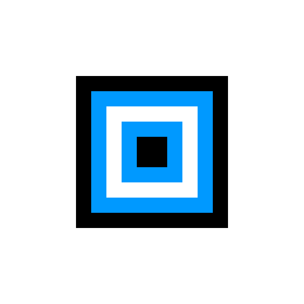

## 3.2 Translating 移动
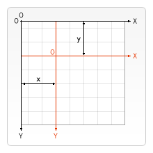
+ `translate(x, y)`
  + translate方法接受两个参数。*x *是左右偏移量，y 是上下偏移量，如右图所示。
  + ctx.translate() 方法将将 canvas 和 canvas 原点往水平和垂直方向各移动一定的距离
  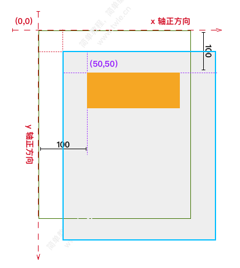
+ 在做变形之前先保存状态是一个良好的习惯。大多数情况下，调用 restore 方法比手动恢复原先的状态要简单得多。又，如果你是在一个循环中做位移但没有保存和恢复 canvas 的状态，很可能到最后会发现怎么有些东西不见了，那是因为它很可能已经超出 canvas 范围以外了。
  ```js
    for (let i = 0; i < 3; i++) {
    for (let j = 0; j < 3; j++) {
      ctx.save();
      ctx.fillStyle = `rgb(${51 * i},${255 - i * 51},255)`;
      console.log(ctx.fillStyle, "fillStyle");
      ctx.translate(10 + j * 50, 10 + i * 50);
      ctx.fillRect(100, 100, 25, 25);
      ctx.restore();
    }
  }
  ```
  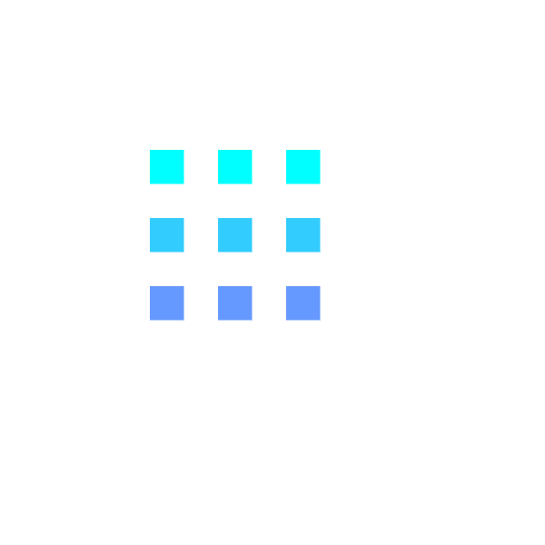

## 3.3 Rotating 旋转

+ `rotate(angle)`
  + 这个方法只接受一个参数：旋转的角度 (angle)，它是顺时针方向的，以弧度为单位的值。

  + 旋转的中心点始终是 canvas 的原点，如果要改变它，我们需要用到 **translate**方法。

+ [注意 这个旋转指的是旋转画布本身](https://www.twle.cn/l/yufei/canvas/canvas-basic-geometric-rotate.html)
+ 绿色 的是屏幕;灰色 的是画布
  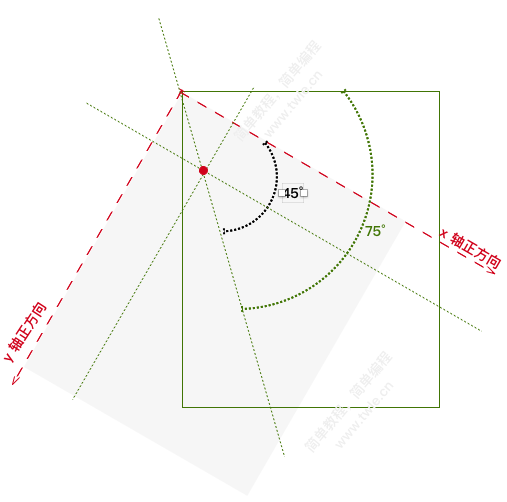
+ 直观结果
  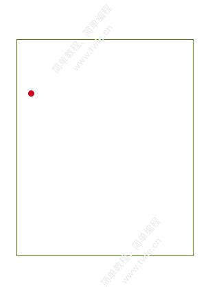
  
  ```js
    ctx.save(); // 记录一个初始状态
  
  ctx.fillStyle = "#0095DD";
  ctx.fillRect(100, 100, 100, 100);
  ctx.rotate((Math.PI / 180) * 25); // 旋转25度
  
  ctx.fillStyle = "#4D4E53";
  ctx.fillRect(100, 100, 100, 100);
  ctx.restore();
  
  ctx.fillStyle = "#0095DD";
  ctx.fillRect(220, 100, 100, 100);
  
  ctx.translate(200, 80); // 更改旋转圆点
  
  ctx.rotate((Math.PI / 180) * 25);
  ctx.translate(-200, -80);
  
  ctx.fillStyle = "#4D4E53";
  ctx.fillRect(220, 100, 100, 100);
  ```
  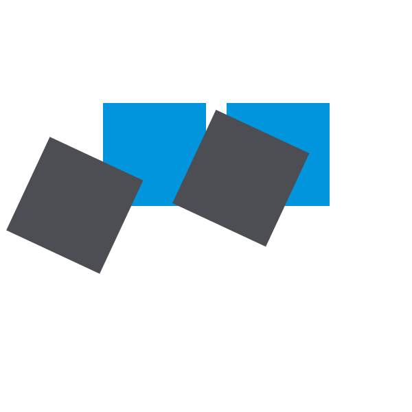

## 3.4 Scaling 缩放
+ 增减图形在 canvas 中的像素数目，对形状，位图进行缩小或者放大。
+ `scale(x, y)`
  + scale方法可以缩放画布的水平和垂直的单位。两个参数都是实数，可以为负数，x 为水平缩放因子，y 为垂直缩放因子，如果比 1 小，会缩小图形，如果比 1 大会放大图形。默认值为 1，为实际大小。
+ 画布初始情况下，是以左上角坐标为原点的第一象限。如果参数为负实数，相当于以 x 或 y 轴作为对称轴镜像反转（例如，使用translate(0,canvas.height); scale(1,-1); **以 y 轴作为对称轴镜像反转，就可得到著名的笛卡尔坐标系，左下角为原点**）。
  
+ **scale 不仅会把width 和 height 进行缩放, 对 原点坐标同样也会进行缩放**如 `ctx.scale(10,10);ctx.fillRect(10,10,10,10);`,放大后的实际执行结果为`ctx.fillRect(10*10,10*10,10*10,10*10)`;
+ Canvas 中的缩放 (scale) 针对的不是绘制的图形，而是针对画布本身
+ 当我们使用 scale(0.5,2) 将画布水平方向缩小一倍和垂直方向放大一倍的时候
+ 就是原来水平方向的 1 个单位现在变成了 0.5 个单位了，垂直方向的 1 个单位现在变成了 2 个单位了

然后在 (100,100) 绘制一个 5x50 的矩形就是这样的了
  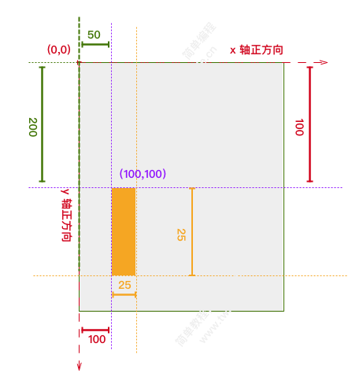
  ```js
    ctx.save();
    ctx.fillRect(10, 10, 10, 10);
    ctx.scale(10, 3);
    ctx.fillRect(10, 10, 10, 10);
    ctx.restore();
  
    // mirror horizontally
    ctx.scale(-1, 1);
    ctx.font = "48px serif";
    ctx.fillText("MDN", -135, 120);
  ```
  

## 3.5 Transform 变形
+ 同样的,Canvas 中的变形 ( Transforms ) 针对的不是绘制的图形，而是针对画布本身
+ 允许对变形矩阵直接修改。
### 3.5.1 `transform(a, b, c, d, e, f)`
+ `transform(a, b, c, d, e, f)`
  + 这个方法是将当前的变形矩阵乘上一个基于自身参数的矩阵，如下面的矩阵所示：
     $$\begin{bmatrix}
        a&c&e\\
        b&d&f\\
        0&0&1\\
        \end{bmatrix}$$
  + 如果任意一个参数是Infinity，变形矩阵也必须被标记为无限大，否则会抛出异常。
    这个函数的参数各自代表如下：
    + a (m11) 
      + 水平方向的缩放
    + b(m12)
      + 竖直方向的倾斜偏移
    + c(m21)
      + 水平方向的倾斜偏移
    + d(m22)
      + 竖直方向的缩放
    + e(dx)
      + 水平方向的移动
    + f(dy)
      + 竖直方向的移动
  + 然后我们再把它和一个坐标(x,y) 相乘(矩阵乘法,左行右列)，因为第二个矩阵的列数要和第一个矩阵的行数相同，所以我们要把坐标再加上一个元素 1
  
  + **[矩阵的唯一作用就是简化多种几何变换之后新的坐标的计算方式](https://www.twle.cn/l/yufei/canvas/canvas-basic-geometric-transform.html)**
### 3.5.2 setTransform(a, b, c, d, e, f)
+ `setTransform(a, b, c, d, e, f)`
  + **这个方法会将当前的变形矩阵重置为单位矩阵，然后用相同的参数调用 transform方法**。如果任意一个参数是无限大，那么变形矩阵也必须被标记为无限大，否则会抛出异常。从根本上来说，该方法是取消了当前变形，然后设置为指定的变形，一步完成。

### 3.5.3 resetTransform()
+ 重置当前变形为单位矩阵，它和调用以下语句是一样的：ctx.setTransform(1, 0, 0, 1, 0, 0);

### 3.5.4 transform/setTransform 例子
+ 矢量和矢量相乘**没有方向**的量叫做向量的 **点击**,矢量和矢量相乘得到**有方向**的量叫做向量的 **叉积**
  
+ 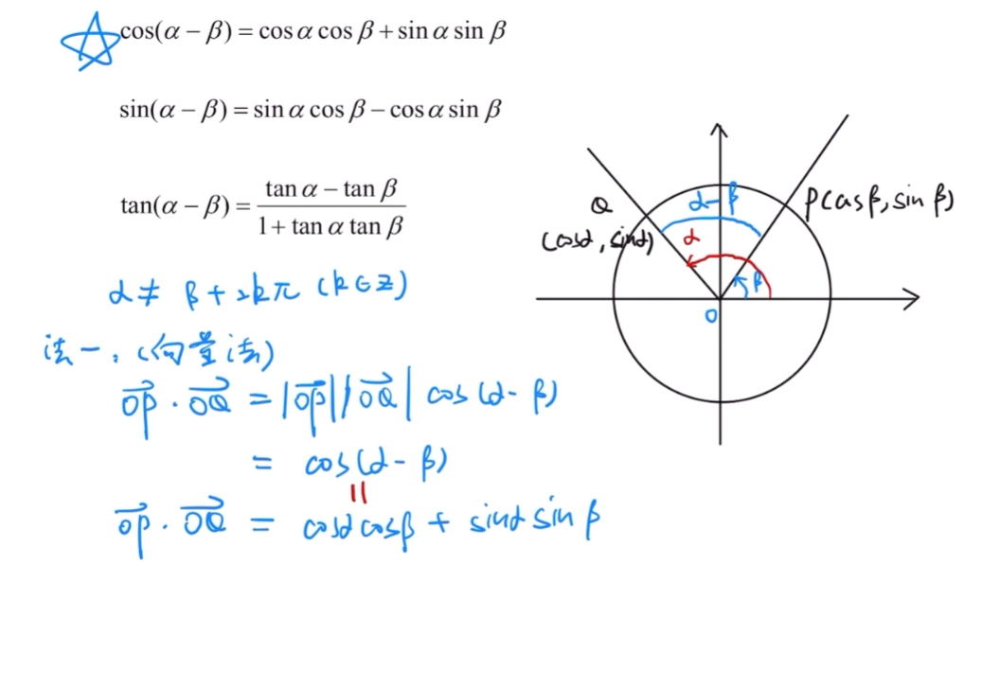
  
+ [极坐标系上的A点经过给定角度得到B点的坐标的计算推演](https://zhuanlan.zhihu.com/p/339668569)
  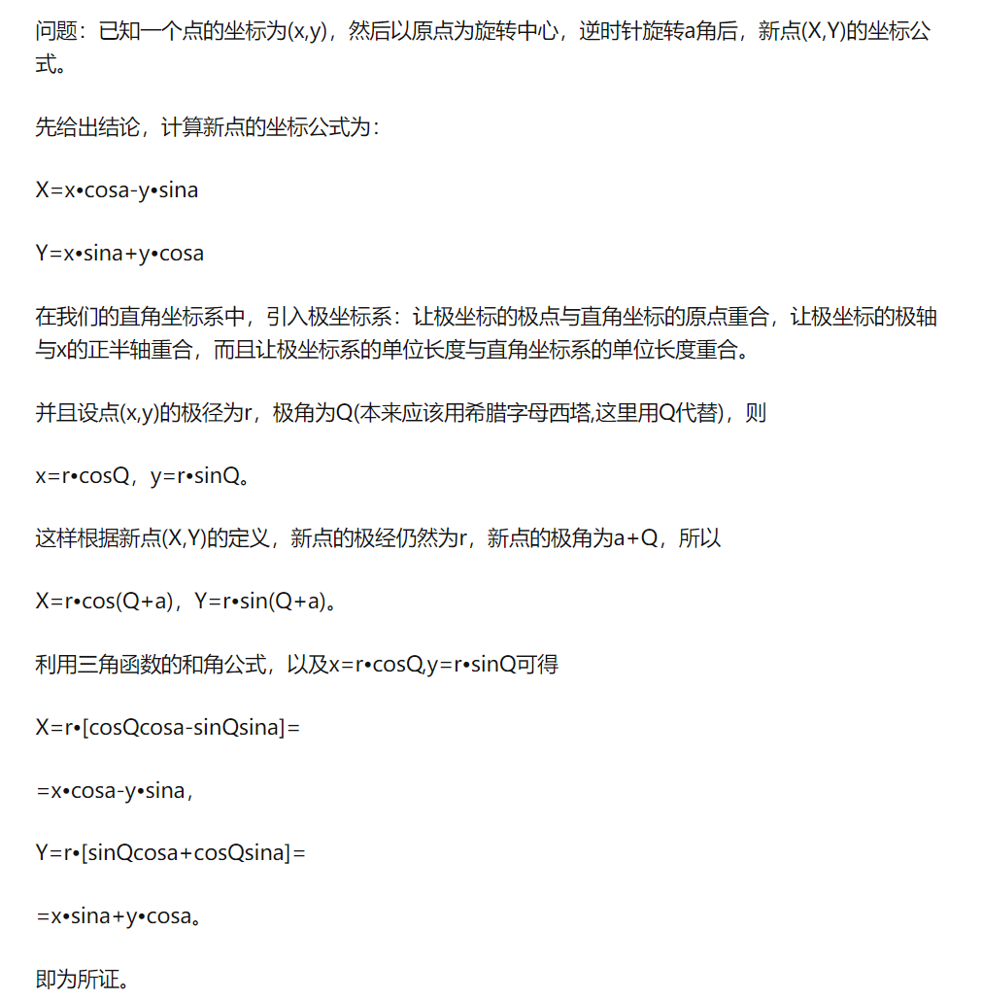
+ **得出的结果为**
  `x2=(x1*cosa-y1*sina);y2=(x1*sina+y1*cosa)`
+ x2 = ax1 + cy1 + e
+ y2 = bx1 + dy1 + f

+ [canvas中角度的计算](https://www.cnblogs.com/gradolabs/p/4766811.html)

#### 1. 使用transform实现 translate函数的位置效果
+ transform(a,b,c,d,**e**,**f**);e,f对应 translate(x,y)上的x,y
+  `ctx.translate(100, 100);`等价于`ctx.transform(1, 0, 0, 1, 100, 100);`
    ```js
      // ctx.translate(100, 100);
      ctx.transform(1, 0, 0, 1, 100, 100);
      ctx.fillRect(0, 0, 100, 100);
    ```

#### 2. 使用transform实现 scale函数的旋转效果
+ transform(**a**,b,c,**d**,e,f)中的a,d对应scale(x,y)的x,y;
+ `ctx.transform(2, 0, 0, 2, 0, 0);`等价于`ctx.scale(2, 2);`
+ **注意:scale操作不但会缩放对应的width和 height,还有坐标的x,y**
```js
 // ctx.scale(2, 2);
  ctx.transform(2, 0, 0, 2, 0, 0);
  ctx.fillRect(10, 10, 100, 100);
```

#### 3. 使用transform 实现斜切skew
  ```js
  //Y轴逐渐拉伸，得到上图右边状态
  ctx.transform(1,Math.PI/18,0,1,0,0);

  ctx.fillRect(200,150,50,50);
  ```
#### 4. 使用transform 实现 rotate的旋转效果
+ ctx.transform(**a**,**b**,**c**,**d**,e,f),需要ABCD这四个参数来实现
  ```js
  // ctx.translate(100, 100);
  // ctx.rotate(Math.PI / 4);

  ctx.transform(
    Math.cos(Math.PI / 6),
    Math.sin(Math.PI / 6),
    -Math.sin(Math.PI / 6),
    Math.cos(Math.PI / 6),
    100,
    100
  );

  ctx.fillRect(0, 0, 100, 10);
  ```
#### 5. 例子
  ```js
    const sin = Math.sin(Math.PI / 6);
    const cos = Math.cos(Math.PI / 6);
    ctx.translate(100, 100);
    let c = 0;
    for (let i = 0; i <= 12; i++) {
      c = Math.floor((255 / 12) * i);
      ctx.fillStyle = "rgb(" + c + "," + c + "," + 0 + ")";
      ctx.fillRect(0, 0, 100, 10);
      ctx.transform(cos, sin, -sin, cos, 0, 0);
      // ctx.rotate(Math.PI / 6);
    }
    ctx.setTransform(-1, 0, 0, 1, 100, 100);
    ctx.fillStyle = "rgba(255, 128, 255, 0.5)";
    ctx.fillRect(0, 50, 100, 100);
  ```
  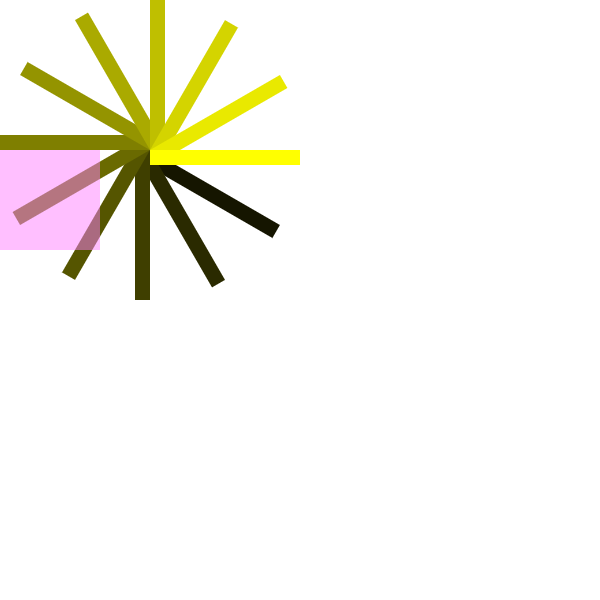