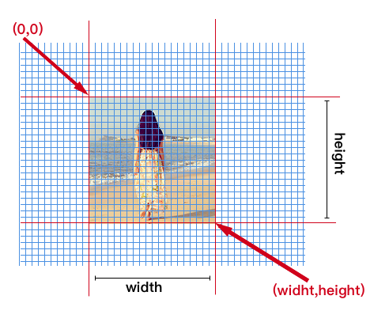
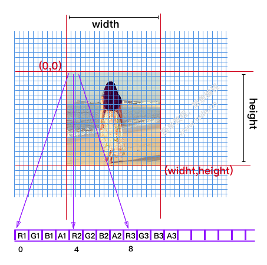
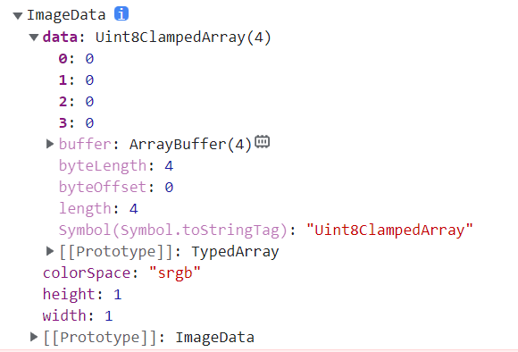
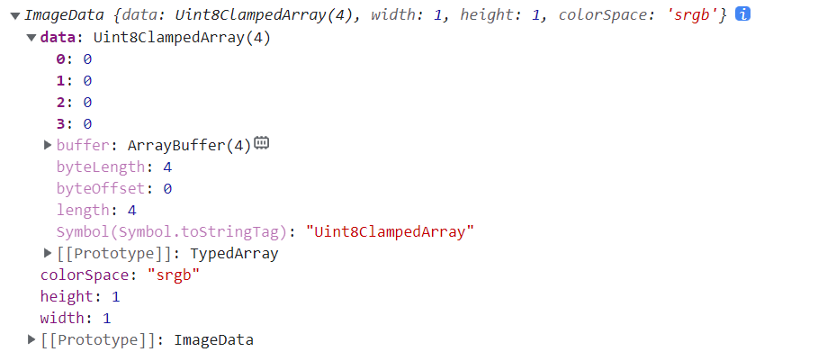
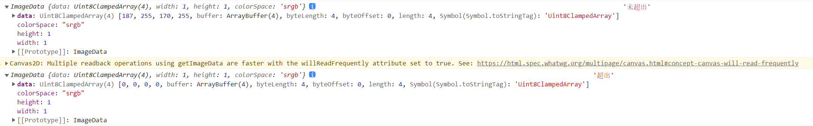
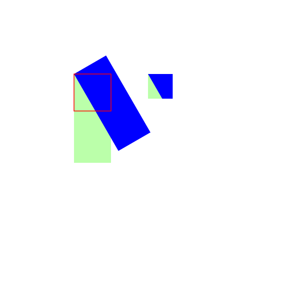

# 	1. 组合 Compositing

## 1. globalCompositeOperation
+ 我们不仅可以在已有图形后面再画新图形，还可以用来遮盖指定区域，清除画布中的某些部分（清除区域不仅限于矩形，像clearRect()方法做的那样）以及更多其他操作。
+ globalCompositeOperation = type
  + 这个属性设定了在画新图形时采用的遮盖策略，其值是一个标识 **12** 种遮盖方式的字符串。
+ source-over
  + 这是默认设置，并在现有画布上下文之上绘制新图形。
+ source-in
  + 新图形只在新图形和目标画布重叠的地方绘制。其他的都是透明的。
+ source-out
  + 在不与现有画布内容重叠的地方绘制新图形。
+ source-atop
  + 新图形只在与现有画布内容重叠的地方绘制。
+ destination-over
  + 在现有的画布内容后面绘制新的图形。
+ destination-in
  + 现有的画布内容保持在新图形和现有画布内容重叠的位置。其他的都是透明的。
+ destination-out
  + 现有内容保持在新图形不重叠的地方。
+ destination-atop
  + 现有的画布只保留与新图形重叠的部分，新的图形是在画布内容后面绘制的。
+ lighter
  + 两个重叠图形的颜色是通过颜色值相加来确定的。
+ copy
  + 只显示新图形。
+ xor 
  + 图像中，那些重叠和正常绘制之外的其他地方是透明的。
+ multiply
  + 将顶层像素与底层相应像素相乘，结果是一幅更黑暗的图片。
+ screen
  + 像素被倒转，相乘，再倒转，结果是一幅更明亮的图片。
+ overlay
  + multiply 和 screen 的结合，原本暗的地方更暗，原本亮的地方更亮。
+ darken
  + 保留两个图层中最暗的像素。
+ lighten
  + 保留两个图层中最亮的像素
+ color-dodge
  + 将底层除以顶层的反置。
+ color-burn
  + 将反置的底层除以顶层，然后将结果反过来。
+ hard-light
  + 屏幕相乘（A combination of multiply and screen）类似于叠加，但上下图层互换了。
+ soft-light
  + 用顶层减去底层或者相反来得到一个正值。
+ difference
  + 一个柔和版本的强光（hard-light）。纯黑或纯白不会导致纯黑或纯白。
+ exclusion
  + 和 difference 相似，但对比度较低。
+ hue
  + 保留了底层的亮度（luma）和色度（chroma），同时采用了顶层的色调（hue）。
+ saturation
  + 保留底层的亮度（luma）和色调（hue），同时采用顶层的色度（chroma）。
+ color
  + 保留了底层的亮度（luma），同时采用了顶层的色调 (hue) 和色度 (chroma)。
+ luminosity
  + 保持底层的色调（hue）和色度（chroma），同时采用顶层的亮度（luma）。


# 2. 裁切 stroke() fill() clip()
+ 裁切路径和普通的 canvas 图形差不多，不同的是它的作用是遮罩，用来隐藏不需要的部分。如右图所示。红边五角星就是裁切路径，所有在路径以外的部分都不会在 canvas 上绘制出来。

+ 如果和上面介绍的 globalCompositeOperation 属性作一比较，它可以实现与 source-in 和 source-atop差不多的效果。最重要的区别是裁切路径不会在 canvas 上绘制东西，而且它永远不受新图形的影响。这些特性使得它在特定区域里绘制图形时相当好用。

+ clip()
将当前正在构建的路径转换为当前的裁剪路径。使用 clip()方法来创建一个新的裁切路径。**默认情况下**，canvas 有一个与它自身一样大的裁切路径（也就是没有裁切效果）。

+ clip例子


# 3. ImageData对象
+ ImageData 对象中存储着 canvas 对象真实的像素数据, 它提供了以下三个只读属性
  + height 
    + 只读，无符号长整型（unsigned long），图片高度，单位是像素
  + width
    + 只读，无符号长整型（unsigned long），图片高度，单位是像素
  + data
    + 只读，Uint8ClampedArray 类型的一维数组，包含着 RGBA 格式的整型数据，范围在 0 至 255 之间（ 包括 255 ）顺序的数据，

## 3.1 Uint8ClampedArray
+ Uint8ClampedArray 是一个 高度 × 宽度 × 4 bytes 的一维数组

+ 我们知道，图片是平面图形，有宽有高，因此我们可以把它看作是一个矩形
  + 如果我们以 1 像素为单位给它绘制一个网格，下面这样
  
  那么有多少个小格子呢 ？
  不用去数啊，直接是 (width / 1 ) x ( height/1 ) = width x height 个
  然后每一个像素格子都是一种颜色，那么总共就有 width x height 个颜色了
  我们知道颜色的存储有 3 字节表示法 ( RGB ) 和 四字节表示法 ( RGBA ) ，Canvas 使用的是 RGBA 存储一个颜色值，也即是一个颜色需要 4 字节来存储
  以，那么 Canvas 中存储一个张 width x height 的图片就需要 高度 × 宽度 × 4 bytes 字节了

  既然知道了 Uint8ClampedArray 是一个 高度 × 宽度 × 4 bytes 的一维数组
  那么它的索引值就是从 0 到 (高度×宽度×4) -1
  那么 Uint8ClampedArray 到底是是怎么存放每个像素的颜色呢？
  很简单，首先创建一个长度为 (高度×宽度×4) 的字节数组，然后按照下面的公式存放第 m 行 n 列颜色(RGBA)
  ```text
  R = 4 * (m-1) * (n-1) + 0;
  G = 4 * (m-1) * (n-1) + 1;
  B = 4 * (m-1) * (n-1) + 2;
  A = 4 * (m-1) * (n-1) + 3;
  ```
  例如第一行第一列的颜色放在
  ```text
  R = 4 * 0 * 0 + 0 = 0
  G = 4 * 0 * 0 + 1 = 1
  B = 4 * 0 * 0 + 2 = 2
  A = 4 * 0 * 0 + 3 = 3
  ```

  第一行第二列的颜色放在
  ```text
  R = 4 * 1 * 1 + 0  = 4
  G = 4 * 1 * 1 + 1  = 5
  B = 4 * 1 * 1 + 2  = 6
  A = 4 * 1 * 1 + 3  = 7
  ```
  
  + 取得第 m 行第 n 列颜色值的 B 值，就可以像下面这样使用
  ```text
  ImageData.data[(m-1)*(n-1)*4+3]
  ```

  + 例如从行 50，列 30 的像素中读取图片的蓝色部份，就会这样写
  ```text
  blue = ImageData.data[(50-1)*(30-1)*4+3] = ImageData.data[7647]
  ```
  获取 Uint8ClampedArray 的长度
  既然 Uint8ClampedArray 是一个数组，我们就可以使用 length 属性来获得数组的长度
  ```
  var len = imageData.data.length
  ```

## 3.2 ImageData 构造函数
+ ImageData 对象也有一个构造函数，跟它自己同名，可以接受三个参数，使用这个构造函数就可以创建一个 ImageData 对象的实例
  ```js
  new ImageData(array, width[, height]);
  new ImageData(width, height);
  ```

| +      | 参数                                                     | 说明 |
| ------ | -------------------------------------------------------- |
| array  | 一个是 `Uint8ClampedArray`，就是一个装满了颜色的一维数组 |
| width  | ImageData 所表示的图像的宽度                             |
| height | ImageData 所表示的图像的宽度                             |

+ 如果使用三个参数的构造方法，那么还有一个约束条件，就是必须满足 `Uint8ClampedArray` 的 `length` 值等于 `4*width*height` ，否则会报错

+ 如果使用两个参数的构造方法，那么会自动创建一个 `4*width*height` 大小的一维数组，然后以 `0` 填充整个像素矩阵

  全部都是 0 是啥意思？ `#000000` 知道是啥颜色吧，对，全部是 0 就表示一个透明黑的图片

  透明黑是啥？ 就是透明的图像啦

+ 如果传递了 `array` 参数，那么 `height` 参数可以选择不传递，如果不传递，那么它会自己计算

  ```js
  height = array.length / ( width * 4 )
  ```

+ 示例
  ```js
    const imgData = new ImageData(1, 1);
    console.log(imgData);
  ```
  

## 3.3 canvas方法 createImageData()
+ Canvas 渲染上下文还提供了方法 createImageData() 来创建一个它的实例
+ `ctx.createImageData()` 用于创建一个 新的、空白的、指定大小的 ImageData 对象
+ 所有的像素在新对象中都是 透明 的
  ```js
    ImageData ctx.createImageData(width, height);
    ImageData ctx.createImageData(imagedata);
  ```

  | 参数      | 说明                                                                       |
  | --------- | -------------------------------------------------------------------------- |
  | width     | ImageData 所表示的图像的宽度                                               |
  | height    | ImageData 所表示的图像的宽度                                               |
  | imagedata | 从现有的 ImageData 对象中，复制一个宽高一样的透明图像 图像自身不允许被复制 |

  1. `createImageData()` 创建的是透明的图像数据
  2. `imagedata` 参数复制的只是图像的宽和高，数据没有复制过去，生成的是透明的图像
  3. 如果宽度或者高度变量值为零，会抛出此异常 `IndexSizeError`

+ 示例:
  + 创建一个 1 x 1 大小的透明的图像数据
  ```js
  var canvas = document.createElement("canvas");
  var ctx = canvas.getContext("2d");
  console.log(ctx.createImageData(1,1)); 
  ```
  

## 3.4 getImageData 获取Canvas数据
+ ctx.getImageData() 用户获取画布上指定区域的图像数据

  这个区域通过矩形表示，起始点为 `(sx, sy)` 、宽为 `sw` 、高为 `sh`

  返回一个 ImageData 对象实例，如果传递的宽度或者高度为 0 ，那么会抛出 `IndexSizeError` 异常

  ### 语法

  ```
  ImageData ctx.getImageData(sx, sy, sw, sh);
  ```

  | 参数 | 说明                            |
  | ---- | ------------------------------- |
  | sx   | 要获取的矩形区域的左上角 x 坐标 |
  | sy   | 要获取的矩形区域的左上角 y 坐标 |
  | sw   | 要获取的矩形区域的宽度          |
  | sh   | 要获取的矩形区域的高度          |

  如果获取的区域超出了画布，那么超出部分使用透明填充
+ 示例:
  ```js
    ctx.fillStyle = "#bfa";
    ctx.fillRect(0, 0, 200, 200);
    console.log(ctx.getImageData(122, 122, 1, 1), "未超出");
    console.log(ctx.getImageData(800, 800, 1, 1), "超出");
  ```
  


## 3.5 putImageData() 绘制画布数据
+ `ctx.putImageData()` 可以把已有的 ImageData 数据绘制到画布上的指定区域
+ 该方法不受画布转换矩阵的影响
+ ## 语法

  ```
  void ctx.putImageData(imagedata, dx, dy);
  
  void ctx.putImageData(imagedata, dx, dy, dirtyX, dirtyY, dirtyWidth, dirtyHeight);
  ```

  | 参数        | 说明                                                                             |
  | ----------- | -------------------------------------------------------------------------------- |
  | imageData   | 一个 ImageData 实例，要绘制的图像数据                                            |
  | dx          | 源图像数据在目标画布中的位置偏移量（x 轴方向的偏移量）                           |
  | dy          | 源图像数据在目标画布中的位置偏移量（y 轴方向的偏移量）                           |
  | dirtyX      | 可选，在源图像数据中，矩形区域左上角的位置。默认是整个图像数据的左上角（x 坐标） |
  | dirtyY      | 可选，在源图像数据中，矩形区域左上角的位置。默认是整个图像数据的左上角（y 坐标） |
  | dirtyWidth  | 可选，在源图像数据中，矩形区域的宽度。默认是图像数据的宽度                       |
  | dirtyHeight | 可选，在源图像数据中，矩形区域的高度。默认是图像数据的高度                       |

  这么多参数，都是意思呢？

  1. 要么把图像数据全部绘制到画布的指定位置
  2. 要么把图像数据的指定区域绘制到画布的指定位置

  ### 注意

  1. 如果任何一个参数设置成无穷大，则会抛出此错误 `NotSupportedError`
  2. 如果 imageData 不是一个完整的图像数据，会抛出错误 `InvalidStateError`

+ 示例:

  ```javascript
    ctx.save();
    ctx.translate(100, 100);
    ctx.fillStyle = "#bfa";
    ctx.fillRect(0, 0, 50, 120);
    ctx.rotate((Math.PI / 180) * -30);
    ctx.fillStyle = "blue";
    ctx.fillRect(0, 0, 50, 120);
    ctx.restore();
    const imgData = ctx.getImageData(100 + 50, 100 + 50, 50, 50);
    ctx.putImageData(imgData, 300, 150);
    ctx.strokeStyle = "red";
    ctx.strokeRect(100, 100, 50, 50);
  ```
  

# 4. 保存为 Blob(二进制)或者URI

[`canvas.toDataURL('image/png')`](https://developer.mozilla.org/zh-CN/docs/Web/API/HTMLCanvasElement/toDataURL)

默认设定。创建一个 PNG 图片。

[`canvas.toDataURL('image/jpeg', quality)`](https://developer.mozilla.org/zh-CN/docs/Web/API/HTMLCanvasElement/toDataURL)

创建一个 JPG 图片。你可以有选择地提供从 0 到 1 的品质量，1 表示最好品质，0 基本不被辨析但有比较小的文件大小。

[`canvas.toBlob(callback, type, encoderOptions)`](https://developer.mozilla.org/zh-CN/docs/Web/API/HTMLCanvasElement/toBlob)

这个创建了一个在画布中的代表图片的 Blob 对像。